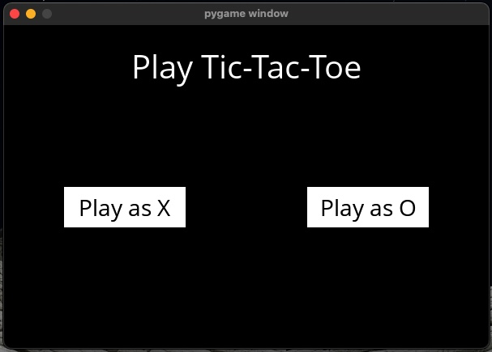
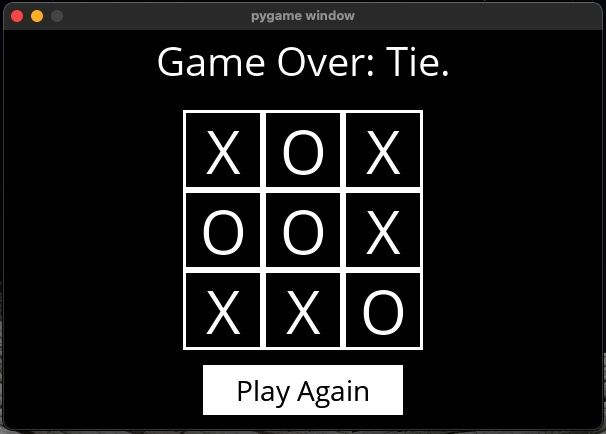

# Tic Tac Toe with AI in Python and Pygame

A simple **Tic Tac Toe** game with an AI opponent implemented using the **Minimax** algorithm.  
The game is built in Python and uses Pygame for the graphical interface.

---

## Features

- Choose to play as X or O.
- Play against an AI that makes optimal moves (unbeatable).
- Visual game board with player moves displayed.
- Shows game result: win, loss, or draw.
- Play again option after the game ends.

---

## Installation

1. Clone the repository or download the project folder.
2. Make sure you have Python 3.6+ installed.
3. Install the required packages:
    ```bash
    pip install -r requirements.txt
    ```
4. Run the game:
    ```bash
    python runner.py
    ```

---

## Project Files

- `tictactoe.py` — game logic and Minimax AI implementation.
- `runner.py` — Pygame graphical interface and user interaction.
- `OpenSans-Regular.ttf` — font used for text rendering in the game.
- `requirements.txt` — list of Python dependencies.

---

## How to Play

- When the game starts, select your player side: X or O.
- Click on an empty cell to make your move.
- The AI will automatically make its move.
- The game continues until someone wins or it’s a draw.
- Click the “Play Again” button to restart the game.

  


---

## Implementation Details

- The AI uses the classic Minimax algorithm to always choose the best move.
- The board state is deep-copied to simulate moves without affecting the current game state.
- Simple mouse controls for intuitive gameplay.

---

## Requirements

- Python 3.6 or higher
- Pygame

---
